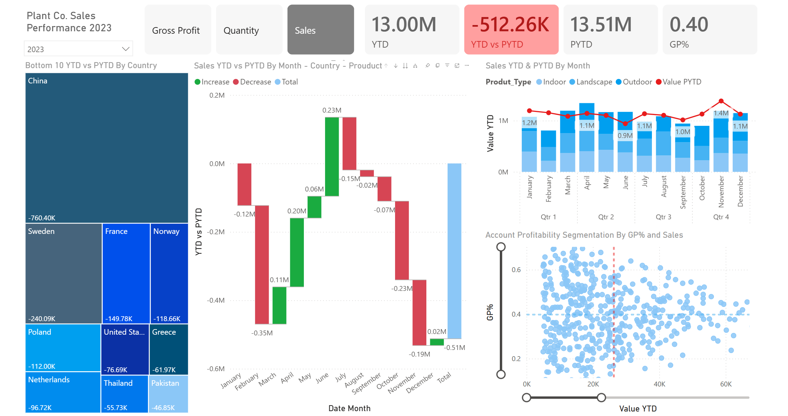
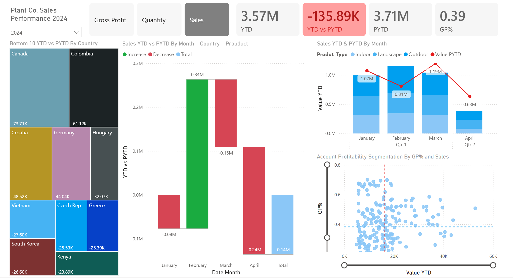
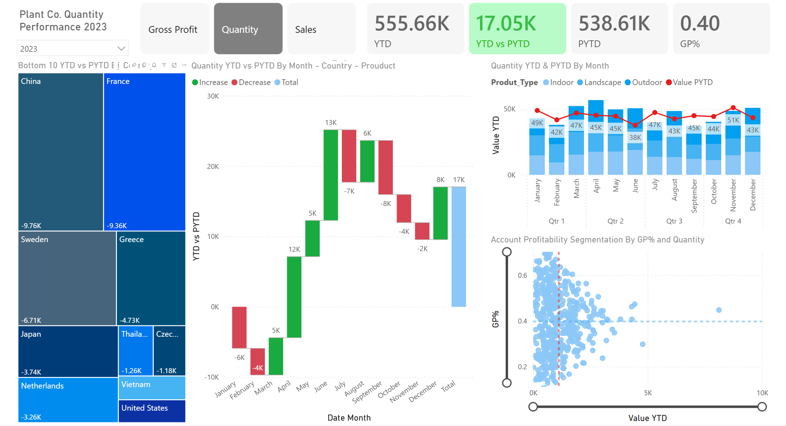
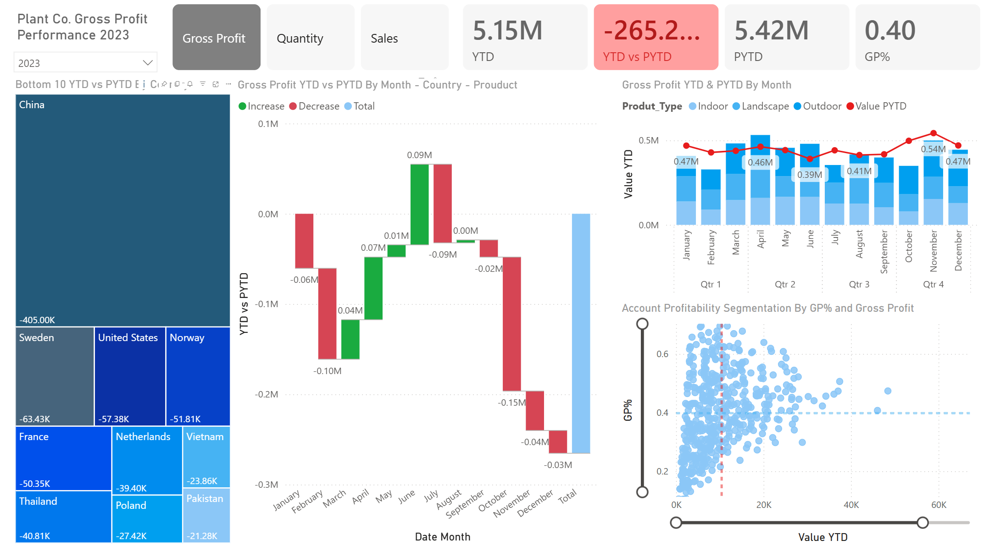
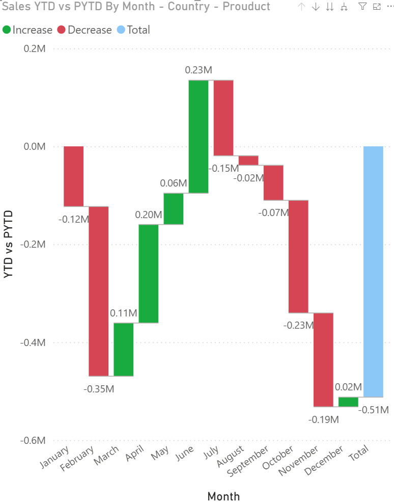
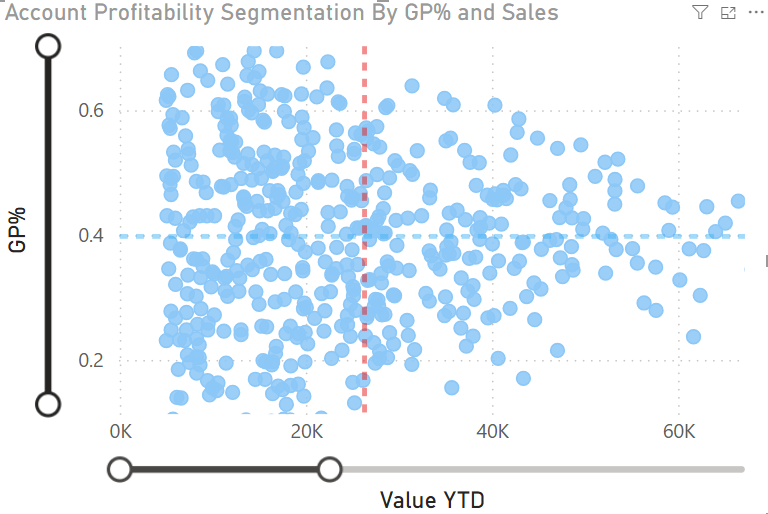

# 🌱 Plant Co. Performance Dashboard (2023)


## 📌 Overview

The Plant Co. Performance Dashboard is an interactive Business Intelligence solution built in Power BI that enables users to analyze business performance across three key metrics:

- 💰 Sales
- 📦 Quantity
- 📈 Gross Profit

The dashboard utilizes dynamic metric selection, allowing all KPIs and visualizations to update instantly based on the selected business metric.

This project demonstrates end-to-end Business Intelligence development including:

- Data Cleaning
- Data Transformation
- Data Modeling
- DAX Calculations
- Interactive Dashboard Design
- Business Performance Analysis

---

# 🎯 Business Problem

Business stakeholders need a flexible way to analyze performance across multiple KPIs without maintaining separate reports.

The objective of this dashboard is to:

- Monitor organizational performance
- Compare YTD and PYTD results
- Analyze country-level trends
- Evaluate product category performance
- Identify profitable customer segments
- Support data-driven decision-making

---

# 📸 Dashboard Screenshots

## Executive Dashboard Overview



---

## Sales Performance View

Shows performance when the Sales metric is selected.



---

## Quantity Performance View

Shows performance when the Quantity metric is selected.



---

## Gross Profit Performance View

Shows performance when the Gross Profit metric is selected.



---

## Monthly Variance Waterfall Analysis

Analyzes monthly performance increases and decreases.



---

## Customer Profitability Segmentation

Scatter plot used to identify high-value and highly profitable customers.



---


# 🚀 Key Features

### Dynamic Metric Switching

Users can dynamically switch between:

- Sales
- Quantity
- Gross Profit

using interactive buttons.

All KPIs and charts update automatically based on the selected metric.

### KPI Performance Monitoring

Track:

- YTD Performance
- PYTD Performance
- Variance
- Percentage Change

### Country Performance Analysis

Analyze performance across countries using treemap visualizations.

### Product Category Analysis

Compare performance across:

- Indoor Products
- Landscape Products
- Outdoor Products

### Monthly Trend Analysis

Identify seasonal trends and performance changes throughout the year.

### Customer Segmentation

Discover:

- High-value customers
- High-margin customers
- Growth opportunities

---

# 📊 Dashboard Components

| Component | Purpose |
|------------|----------|
| KPI Cards | Executive performance monitoring |
| Metric Selector | Dynamic KPI switching |
| Treemap | Country performance analysis |
| Waterfall Chart | Monthly variance analysis |
| Trend Chart | Product category trends |
| Scatter Plot | Customer segmentation |

---

# 🛠 Tools & Technologies

| Tool | Usage |
|--------|--------|
| Power BI Desktop | Dashboard Development |
| Power Query | Data Transformation |
| DAX | KPI Calculations |
| Excel | Data Source |
| Data Modeling | Relationship Management |

---

# 🏗 Data Model

The solution follows a star schema design consisting of:

### Fact Table

- Sales Transactions

### Dimension Tables

- Product
- Customer
- Country
- Date

This model enables efficient reporting and advanced DAX calculations.

---

# 📐 DAX Concepts Used

### Time Intelligence

- YTD Calculations
- PYTD Calculations
- Variance Analysis

### Dynamic Measures

- Metric Selection
- KPI Switching
- Conditional Logic

### Business Metrics

- Sales
- Quantity
- Gross Profit
- Growth %

---

# 💡 Business Insights Generated

The dashboard helps answer:

- Which countries are underperforming?
- Which products contribute most to business success?
- How does current performance compare to previous periods?
- Which customer segments generate the highest value?
- What trends exist across different performance metrics?

---

# 🎯 Skills Demonstrated

### Power BI

- Dashboard Development
- Interactive Reporting
- Advanced Visualizations
- Bookmarks & Buttons

### Data Analytics

- Performance Analysis
- Trend Analysis
- Customer Segmentation
- Business Reporting

### DAX

- Dynamic Measures
- Time Intelligence
- KPI Development
- Variance Calculations

### Data Modeling

- Star Schema Design
- Relationship Management
- Calendar Tables

---

# 📂 Repository Structure

```text
Plant-Co-Performance-Dashboard/
│
├── README.md
│
├── data/
│   └── Plant_DTS.xls
│
├── powerbi/
│   └── Plant Co. Performance Report.pbix
│
├── screenshots/
│   ├── dashboard-overview.png
│   ├── sales-view.png
│   ├── quantity-view.png
│   ├── gross-profit-view.png
│   ├── monthly-waterfall-analysis.png
│   ├── profitability-segmentation.png

```

---

# 🚀 Business Impact

This dashboard transforms raw business data into actionable insights by:

- Improving visibility into business performance
- Supporting strategic decision-making
- Monitoring key business metrics
- Identifying growth opportunities
- Providing executive-level reporting

---

# 👨‍💻 Author

## Aryan Kharvar

**M.Sc. Computational Sciences**

Data Analytics | Business Intelligence | Power BI | SQL | Python

💼 LinkedIn: [Aryan Kharvar](https://www.linkedin.com/in/aryankharvar)


---

⭐ If you found this project useful, consider giving it a star.
